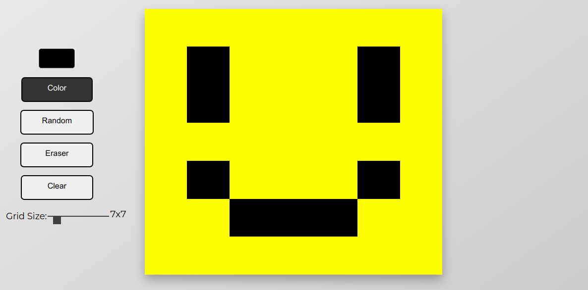
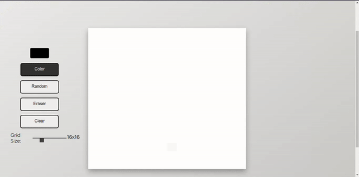
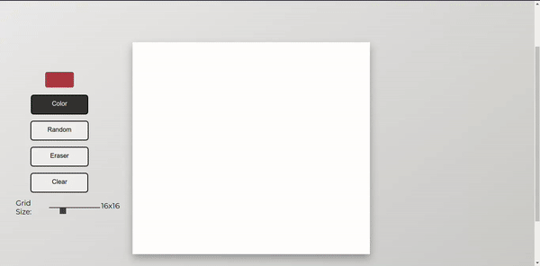
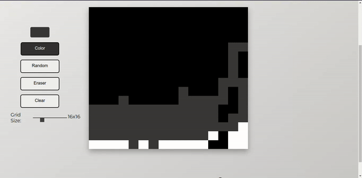
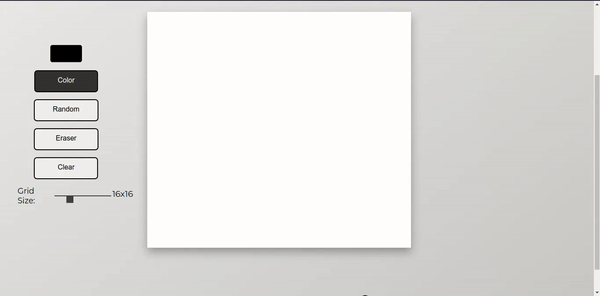

# etch-a-sketch
A simple pixelated art making web page made using HTML, CSS and Javascript.

## Table of Contents
* [Game Preview](#game-preview)
* [Features](#features)
* [Demo](#demo)
* [Where to Play?](#where-to-play)
* [Creator](#creator)
* [Credits](#credits)
* [License](#license)

## Game Preview

# Features
* Make any type of art
* Pick colors of your choosing
* Pick the canvas size to your liking!

# Demo

# Where to Play?
* #### [GitHub Deployment](https://saurav-png.github.io/etch-a-sketch/)
* #### [Netlify Site](https://saurav-etch-a-sketch.netlify.app/)

## Creator
[Saurav Tiwari](https://www.linkedin.com/in/saurav-md/)

## Credits
* [Font Awesome](https://fontawesome.com/) [CDN link is included in `index.html`]
* The image were sourced from [pngegg.com](https://www.pngegg.com)
* Favicon was created using [favicon.io](https://favicon.io/)

## License
This project is licensed under the [MIT License](https://choosealicense.com/licenses/mit/).
